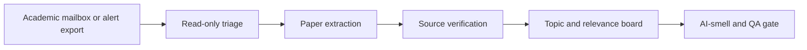

# Mail2PaperList Skill

Portable workflow skill for turning academic email alerts, Scholar alerts, and webmail paper leads into a source-checked, filterable paper board.

## Who This Is For

| Use this when you... | Use something else when you... |
| --- | --- |
| need to triage academic email alerts into a reading board | only need to draft or reply to email |
| want paper source links, relevance, topics, and summaries | only want a single paper explained |
| need a checkpointed webmail workflow with privacy guardrails | need mailbox cleanup, unsubscribe, or message deletion |

## Why This Exists

- Academic alert inboxes are noisy but contain useful paper leads.
- A reproducible workflow prevents losing progress across long mailbox passes.
- Source verification and AI-smell checks keep generated paper summaries useful rather than generic.

## What Ships

| Component | Role |
| --- | --- |
| [`mail2paperlist`](./mail2paperlist) | installable Codex App skill package |
| [`mail2paperlist/references/sop.md`](./mail2paperlist/references/sop.md) | generic SOP from mailbox triage to paper board |
| [`mail2paperlist/scripts/extract_visible_papers_text.mjs`](./mail2paperlist/scripts/extract_visible_papers_text.mjs) | helper to extract board-visible text for review or AI-smell checks |
| [`mail2paperlist/test-prompts.json`](./mail2paperlist/test-prompts.json) | trigger and non-trigger examples |
| [`CHANGELOG.md`](./CHANGELOG.md) | release history |
| [`LICENSE`](./LICENSE) | license |

## Install / Use

### Codex App

- Install the skill from this repo path: `mail2paperlist`
- GitHub install target:
  - repo: `Mingdao007/mail2paperlist-skill`
  - path: `mail2paperlist`
- Restart Codex App after installation so the new skill is discovered.

## Workflow

## Coverage

- read-only webmail triage with explicit side-effect boundaries
- paper source normalization and verification
- topic and relevance classification for paper screening
- filterable HTML or Markdown board generation
- checkpoint/resume behavior for long runs
- visible-text extraction for final audit gates

## Expected Result / Verification

| Check | Expected result |
| --- | --- |
| Install target | `mail2paperlist` |
| GitHub target | `Mingdao007/mail2paperlist-skill` with path `mail2paperlist` |
| Skill entrypoint | `mail2paperlist/SKILL.md` exists |
| Trigger examples | `mail2paperlist/test-prompts.json` |
| Privacy check | public package contains no private mailbox data, cookies, browser state, or generated user paper board |

## Trigger Examples

- `Use Mail2PaperList to turn these Scholar alerts into a paper board.`
- `Triage this academic webmail inbox into papers with source links and summaries.`
- `Build a filterable HTML board from paper alert emails.`

## Non-Trigger Examples

- `Draft a reply to this email.`
- `Explain this one paper section.`
- `Delete or unsubscribe from these messages.`

## Privacy Boundary

This public repository keeps the workflow generic and reusable.

- It does not include any private mailbox data, cookies, local browser profile state, generated paper lists, or user-specific output files.
- Webmail actions are documented as read-only by default.
- Mark-as-read, downloads, deletions, replies, forwarding, unsubscribe actions, and mailbox reorganization are outside the default workflow unless the user explicitly authorizes them.

## Repository Layout

| Path | Purpose |
| --- | --- |
| [`mail2paperlist`](./mail2paperlist) | installable Codex App skill package |
| [`mail2paperlist/references`](./mail2paperlist/references) | public SOP references |
| [`mail2paperlist/scripts`](./mail2paperlist/scripts) | generic helper scripts |
| [`mail2paperlist/test-prompts.json`](./mail2paperlist/test-prompts.json) | trigger and non-trigger examples |

Chinese:

- [README.zh-CN.md](./README.zh-CN.md)
